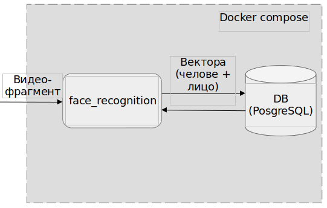

# Roterman Viktor master's degree diploma👨‍🎓

Module for face recognition on video. Algoritm based on person trecking and detection face on tracked person.  
## Architecture




# Befor using
!!! FOR STARTING YOU MUST HAVE VIDEOCARD WITH CUDA!!! 
install required libraries
```shell
pip install requirements.txt
```

in file diploma_docker_compose.yml change on your parametrs DB
```shell
POSTGRES_USER: viktor
POSTGRES_PASSWORD: 1452
POSTGRES_DB: diploma_db
```

init and up db
```shell
make istall
make up
```

and finally yoy can run main.py
```shell
python3 main.py
```

when scripts start, you must answer on 3 questions:

- 1 question
```shell
Do you want save crop image?
Please enter - y/n:
```
if you enter 'y', next step
```shell
Enter dir for video:
```
for example
```shell
Enter dir for video:/home/viktor/projects/diploma_fr/dploma_face_recognition/experiments
```
- 2 question
```shell
Do you want write and show video with detection?
Please enter - y/n:
```
- 3 question
```shell
Do you want save file with results?
Please enter - y/n:
```

and finally you must enter path for video file
```shell
Please enter path to video file -
```
